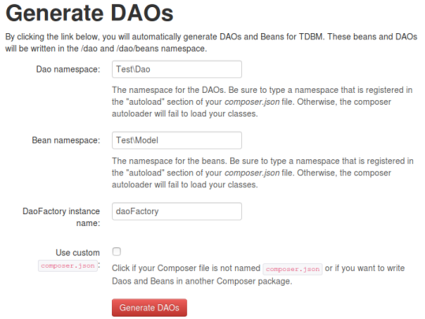
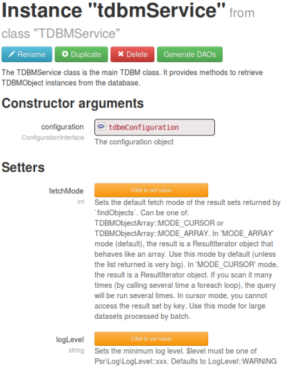
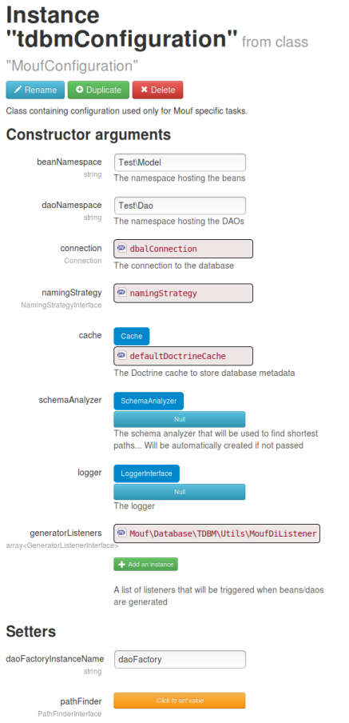

Installation with Mouf
----------------------

Historically, TDBM was the ORM of the Mouf PHP framework. It became a standalone package starting with TDBM 5.0.

To install TDBM with Mouf:

```bash
$ composer require mouf/mouf ~2.0.0
$ composer require mouf/database.tdbm ^5.0
```

Once composer install is done, access the Mouf user interface (http://[your server]/[your app]/vendor/mouf/mouf).
In the user interface, run the graphical installer.

The installer will help you set up the complete environment.

Mouf integration also offers a nice UI in the "Database" menu that helps you regenerate your DAOs and beans.

Generating DAOs and beans
-------------------------

In order to generate the DAOs and beans, the easiest way is to connect to the Mouf user interface, then click on:

- **DB** > **TDBM** > **Generate DAOs and beans**

<div class="alert alert-info">This process is automatically done when you install the package, but should you modify the data model, you will need to 
regenerate the DAOs.</div>



On this screen, you can choose the namespace that will contain the DAO classes, and the namespace that will contain the Beans. Also,
a `DAOFactory` object (that allows easy access to each DAO) will be generated. Let's just keep the default settings and click the
"Generate DAOs" button.

That's it, we generated all the DAOs for our database. Let's have a closer look at what was generated.

Note: if you are using Eclipse, we strongly recommend you to refresh your project, to load the new classes.

Accessing DAOs
--------------

TDBM will automatically generate in Mouf **one instance per DAO**.

So if you have a `UserDao` class, you will find in Mouf a `userDao` instance.

Therefore, you can access it using:

```php
$userDao = Mouf::getUserDao();

$user = $userDao->getById(42);
echo $user->getLogin();
```

But of course, we all know you should not use the `Mouf::getXXX` methods and instead inject the DAOs you need in your services' or controllers' constructors!

About TDBM install (advanced)
-----------------------------

### The *tdbmService* instance

During installation, TDBM will generate a "tdbmService" instance.



As you can see, this instance only relies on a "tdbmConfiguration" instance.



This instance is already configured, but should you need to modify any configuration, you should modify this very instance.

In particular, it is the place where you can customize:

- the database connection
- the cache used by default
- the ["naming strategy"](configuring_naming.md)


### Setting up the cache service

By default, Doctrine's `ApcuCache` service is used if available and will fallback to `PhpFileCache` otherwise.
If the Mouf's `DEBUG` configuration is set to `true`, the cache is disabled.

TDBM requires a cache in order to store database related data. Indeed TDBM stores in cache the structure of the database,
and relies heavily on declared foreign keys to perform the "smartest" queries. Instead of querying the database for those
foreign keys, it will query them once, and put them in cache. This means that if you modify the database model, you will
need to purge the TDBM cache.

TDBM relies on Doctrine cache system. You are free to choose the best one amongst the Doctrine services
implementing the `Cache` interface.

Next step
---------

Let's now learn how to [access the database](quickstart.md).
